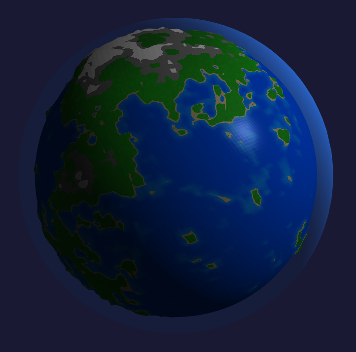

# Planet renderer

A procedural planet generator powered by OpenGL build in C++. Uses the GLAD and GLFW libraries for OpenGL functions and window creation

## Planet generation

The planets are generated using several value noises overlayed on top of each other which then offset the height of each vertex

The color is then decided with a palette of materials based on height. Each material has its own ambient, specular and diffuse color along with reflectivity

Each planet can also have an atmosphere which reacts to lighting and player proximity

## Made with OpenGL

The entire rendering pipeline is made from custom OpenGL wrappers which were designed to be flexible in almost any scenario

They can streamline manipulating with OpenGL buffers, shaders, framebuffers, vertex arrays and more

## List of used libraries
 - glfw
 - glad
 - glm
 - OpenGL
 - Dear ImGui

## Compiling & Building

### Requirements

To build and run this project you will need to have the following installed

- VCPKG
    - On Windows it is preferred to have the **VCPKG_ROOT** variable set
- CMake
- Ninja
- GCC
- OpenGL 4.6.0 or greater

### Windows

> `cmake -S . --preset release`

> [!NOTE]
> If you do not have **VCPKG_ROOT** enviroment variable configured use the following command instead:
> 
> `cmake -S . --preset release -DCMAKE_TOOLCHAIN_FILE="PATH\TO\VCPKG\CMAKE\vcpkg.cmake"`

To build all files (or any changed files later on) run

> `cmake --build build`

### Linux

> `cmake -S . --preset release-linux -DCMAKE_TOOLCHAIN_FILE="/PATH/TO/VCPKG/CMAKE/vcpkg.cmake"`

To build all files (or any changed files later on) run

> `cmake --build build`

### Running

The `build` directory includes the executable file called `PlanetGenerator.exe` or `PlanetGenerator`

Run this file from inside the build directory